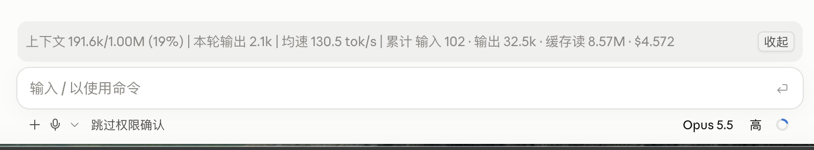
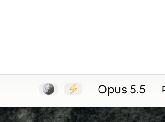
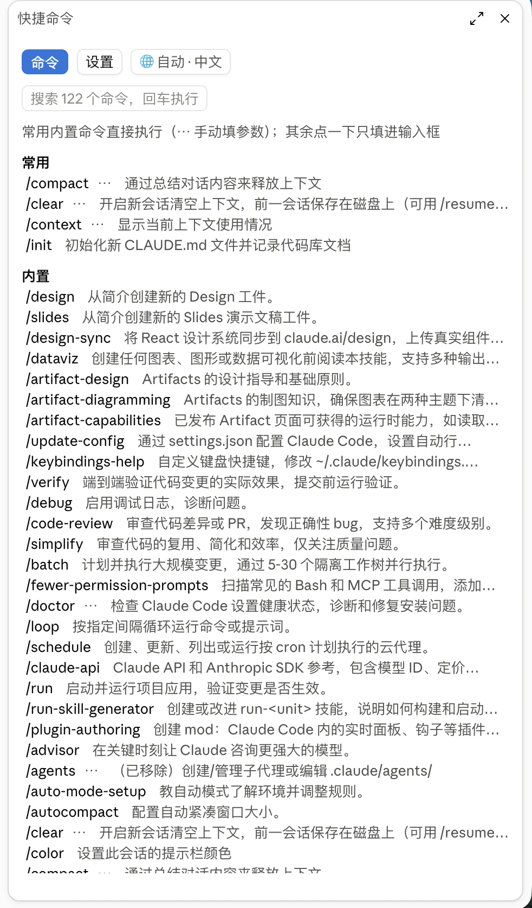
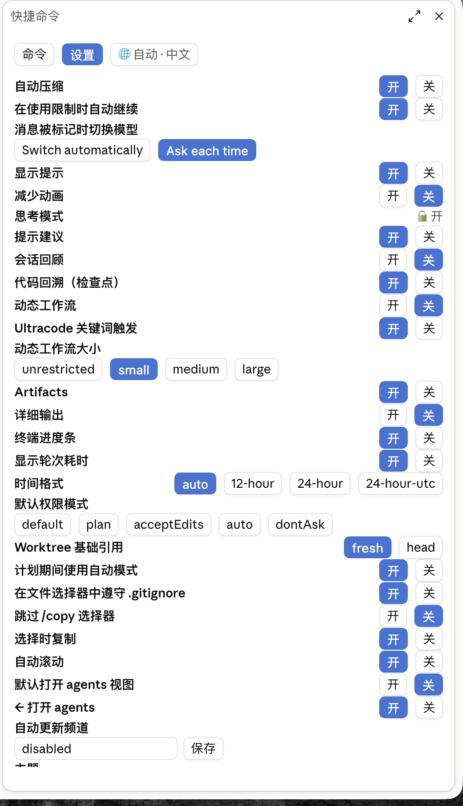
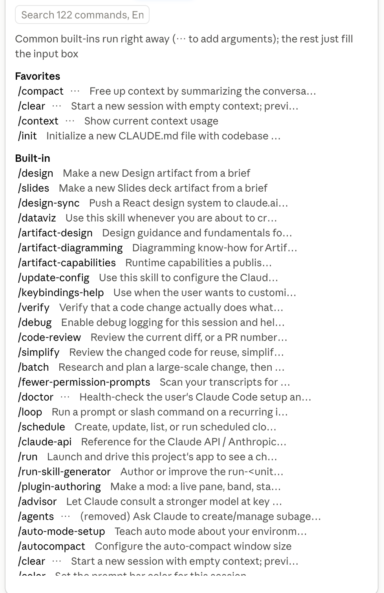
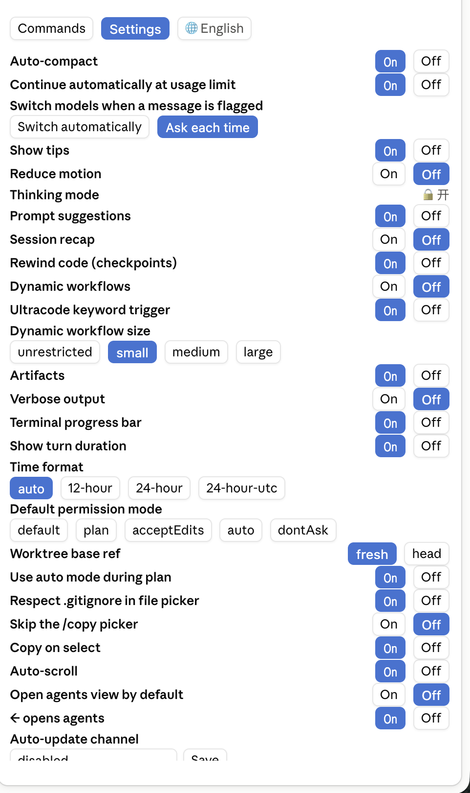

# jack-mods

**English** · [简体中文](README.zh-CN.md)

My own Claude Code mods.

## token-band

A live token-usage band above the prompt box:



Click "收起" (collapse) and the whole band disappears; only a 🪙 is left at the right of the toolbar below the prompt box. Click it to expand again:


```
271.1k/1.00M (27%) · 本轮 3.3k · 113 tok/s · 总输入 7.92M · 总输出 38.4k · 缓存 98% · $8.58 · 5h 99% · 7d 70% ✅   [收起]
```

> The band's own labels are still in Chinese (本轮 = this turn, 总输入 / 总输出 = total input / output, 缓存 = cache, 收起 = collapse).

| Item | Meaning |
|---|---|
| `271.1k/1.00M (27%)` | Current context size / model window |
| `本轮` (this turn) | Output tokens generated so far this turn, ticking up while the reply streams |
| `tok/s` | Average output speed: total output ÷ total generation time (first to last token, excluding time to first token) |
| `总输入` / `总输出` (total in / out) | Session totals, including cache reads/writes and subagents |
| `缓存` (cache) | Share of total input served from cache; higher is cheaper |
| `$` | Session cost |
| `5h` / `7d` | Share of the 5-hour / 7-day subscription limit used (hidden on API billing) |
| `✅` / `❌` | Model check: turns ❌ and shows a toast with the reason when the main thread was switched to another model, the model returned by the API differs from the one requested, or thinking effort was silently lowered |

- On narrow windows the band wraps to two lines, with the collapse button pinned to the right of the first line.
- You can also type `/tokens` to toggle between expanded and collapsed.

## quick-commands

Adds a ⚡ button to the right of the model name. It opens a side panel so you don't have to type `/xxx` by hand:

- **Commands tab**: lists every slash command in the current session (built-in, your own, plugins and skills, MCP), grouped and searchable.
  - Common built-ins (`/compact`, `/clear`, `/context`, `/cost`, `/resume`, …) run with one click.
  - Everything else (skills, plugin and MCP commands) only fills `/name ` into the prompt box so you can add arguments and send it yourself. Nothing fires by accident.
  - The `⋯` next to a built-in lets you type arguments; when a command's output lists "Available: a, b, c" the mod remembers it and shows those as buttons next time.
- **Settings tab**: the `/config` settings as click targets. Toggles get On / Off, pick-one settings get one button per option, text and number settings get an input box. The current value has a blue background.
- **Chinese / English**: the UI follows `language` in `settings.json` or the system language by default; the 🌐 button switches between Auto / 中文 / English by hand. In Chinese, the English command and setting descriptions are translated with haiku and cached. In English, the engine's own descriptions are shown untouched.
- Click ⚡ to open; click it again (now ✕) or press Esc to close.

The ⚡ button, to the right of the model name:



Chinese UI (Commands tab and Settings tab):




English UI (descriptions and setting names are the engine's originals, unchanged):




## Install

One line (paste into a terminal):

```bash
claude plugin marketplace add crebot51/jack-mods && claude plugin install token-band@jack-mods
```

To install quick-commands, swap the last name for `quick-commands@jack-mods` (no need to add the marketplace again if you already have).

Then start a new session. token-band's band shows up on desktop only after the first message; quick-commands' ⚡ sits to the right of the model name.

Update: `claude plugin update <name>`
Uninstall: `claude plugin uninstall <name>`

> The mod API is an early preview and may need updates across Claude Code versions.
